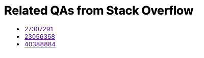

# A chrome extention that retrieves the three most related Q&As from Stack Overflow

## Documentations

1. [project_proposal.pdf](https://github.com/chadyuu/QA-recommender-extension/blob/main/project_proposal.pdf)
2. [project_progress.pdf](https://github.com/chadyuu/QA-recommender-extension/blob/main/project_progress.pdf)
3. [documents.pdf](https://github.com/chadyuu/QA-recommender-extension/blob/main/document.pdf) (overview of functions, implementation documentation, and usage documentation)

## Software usage tutorial presentation

WIP

## How to install the Chrome extension

1.  First, clone the repository.

``` bash
git clone https://github.com/chadyuu/QA-recommender-extension.git
```

2.  Open <chrome://extensions/> on Google Chrome.
3.  Turn on the developer mode by checking "Developer mode" checkbox in the top right-hand corner.
4.  Click "Load unpacked" and select the `QA-recommender-extension/extension` folder.

## The usage

Here is one instance for the usage of the extension.

1.  Pull the Docker image from Docker Hub.

``` {.bash .ash}
docker pull yutaronishiyama/qa-recommender
```

2.  Launch the API server in the Docker container.

``` bash
cd QA-recommender-extension/extension
docker run -p 5000:5000 yutaronishiyama/qa-recommender
```

3.  Open [a page with a title "BM25 Similarity in Elasticsearch" on Stack Overflow](https://stackoverflow.com/questions/26713411/bm25-similarity-in-elasticsearch).
4.  Click the QA recommender extension on the top-right of the Chrome browser.
5.  You can see the following three most related Q&A articles in the opened tab.
    1.  [BM25 Similarity Tuning in Elasticsearch](https://stackoverflow.com/questions/27307291/bm25-similarity-tuning-in-elasticsearch)

    2.  [How can I configure my index to use BM25 in ElasticSearch using the JAVA API?](https://stackoverflow.com/questions/23056358/how-can-i-configure-my-index-to-use-bm25-in-elasticsearch-using-the-java-api)

    3.  [elasticsearch 5.0 and index template](https://stackoverflow.com/questions/40388884/elasticsearch-5-0-and-index-template)



You can confirm that all of three articles similar to the original one. Please try this Chrome extension on other Stack Overflow articles!